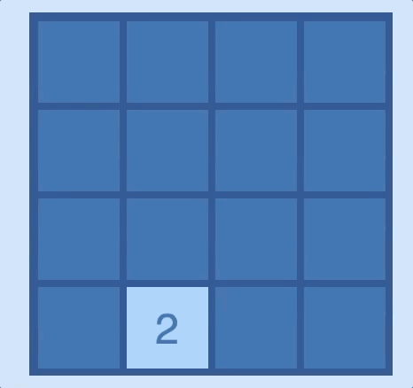
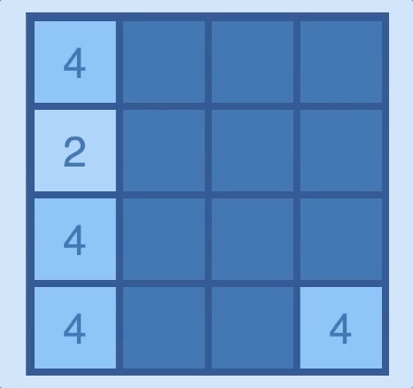
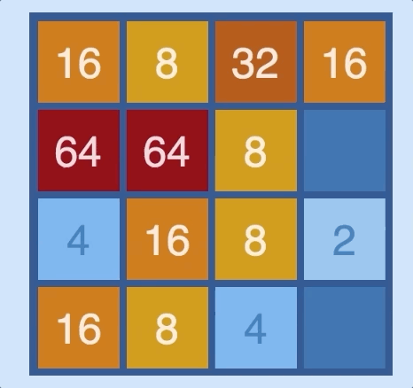
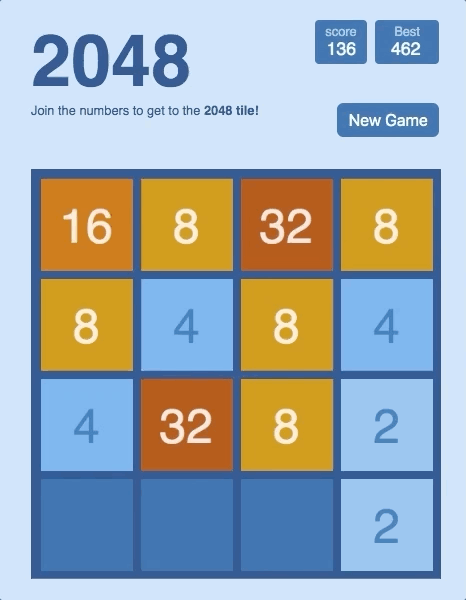
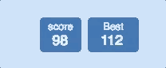

# 2048
[2048 live](https://hakeemmidan.github.io/2048/)

## Technologies
- Vanilla JavaScript
- HTML5 Canvas
- HTML5
- CSS3

## Background and Overview
2048 is a game where you could move square blocks around a contained grid. Once two square of the same value touch, then their values would sum and become one square. The goal of the game is to reach a square that has a value of 2048. All the squares are of even numbers.
Disclaimer: This game was originally made by Gabriele Cirulli. This is a clone of it that I am doing to practice HTML5 Canvas.

## Setup
- `npm install` to install dependencies
- `npm start` to start Webpack (do this in one terminal window)
- Open `index.html`'s path in a new tab in your browser

## Features + How to play

Dynamicallly move around using arrow keys or AWSD:



This is done by using JavaScript's document event listeners:

```JavaScript
export class InputHandler {
    constructor(cell) {
        document.addEventListener('keydown', (e) => {
            if ([37, 38, 39, 40].indexOf(e.keyCode) > -1) {
                e.preventDefault();
            }
            if (e.repeat) return
            switch (e.keyCode) {
                case 38:
                case 87:
                    cell.moveUp()
                    break;
                case 39:
                case 68:
                    cell.moveRight()
                    break;
                case 40:
                case 83:
                    cell.moveDown()
                    break;
                case 37:
                case 65:
                    cell.moveLeft()
                    break;
                default:
                    break;
            }
        })
    }
}
```

Notice that we prevented the default behavior for the arrow keys to disallow default scrolling on the page.

----- 

A right arrow or 'D' key click would move all the squares in the indicated direction, as such:



This is done by moving the cells until they reach a colliding point with the walls:

```JavaScript
update(deltaTime) {
    if (!deltaTime) return
    this.position[this.movementAxis] += this.speed
    if (this.position.x < 0) {
        this.speed = 0
        this.position.x = 0
    } else if (this.position.x > this.gameHeight - this.cellHeight - this.padding ) {
        this.speed = 0
        this.position.x = this.gameHeight - this.cellHeight - this.padding
    } else if (this.position.y < 0) {
        this.speed = 0
        this.position.y = 0
    } else if (this.position.y > this.gameHeight - this.cellHeight - this.padding) {
        this.speed = 0
        this.position.y = this.gameHeight - this.cellHeight - this.padding
    }
}
```

Colliding with other cells is a another story. Check out the logic in `checkCollusion(cell)` from `public/javascripts/cell.js` to learn more about cell-to-cell collusion.

----- 

When there are no more possible moves for all squares on the grid:



A game is over if there are __NO__ two neighboring cells in all rows and columns: 

```javaScript
checkGameOver() {
  let rows = this.getAllRows()
  let columns = this.getAllColumns()
  this.gameOverBool = true

  if (this.gameMovingObjects.length < 16) {
      return false
  }

  rows.forEach(row => {
      row.sort((cell1, cell2) => cell1.position.x - cell2.position.x)
      if (this.hasConsecutiveEqualValues(row)) {
          this.gameOverBool = false
      }
  })

  columns.forEach(col => {
      col.sort((cell1, cell2) => cell1.position.y - cell2.position.y)
      if (this.hasConsecutiveEqualValues(col)) {
          this.gameOverBool = false
      }
  })

  return this.gameOverBool
}
```
We check the cell count before checking all the rows and columns. That is because, it is more efficent to do so. Plus, a game could not be over if there is a single un-filled cell parking space.

----

Once a game is over, you may click on the 'new game' button, which clears out the canvas and starts a new game:



```JavaScript
document.getElementById('new-game-button').addEventListener('click', () => {
        ctx.clearRect(0, 0, GAME_HEIGHT, GAME_HEIGHT)
        currentScoreCtx.clearRect(0, 0, 65, 50)
        bestScoreCtx.clearRect(0, 0, 80, 50)
        game.currentScore = 0
        game.gameMovingObjects = []
        game.gameOverBool = false
        game.start()
        game.addCell()
        gameLoop()
})
```

-----

The current score and the best score automatically update because they are both canvases as well:



```HTML
<div class="heading-boxes">
  <div class="current-score-container">
    <div class="current-score-label">
      score
    </div>
    <canvas
      id="current-score-value-canvas"
      height="25"
      width="50">
    </canvas>
  </div>
  <div class="best-score-container">
    <div class="best-score-label">
      Best
    </div>
    <canvas
      id="best-score-value-canvas"
      height="25"
      width="70">
    </canvas>
  </div>
</div>
```

```JavaScript
const currentScoreCanvas = document.getElementById('current-score-value-canvas')
const currentScoreCtx = currentScoreCanvas.getContext('2d')

const bestScoreCanvas = document.getElementById('best-score-value-canvas')
const bestScoreCtx = bestScoreCanvas.getContext('2d')
    
function gameLoop(timeStamp) {
    let deltaTime = timeStamp - lastTime
    lastTime = timeStamp
    currentScoreCtx.clearRect(0, 0, 65, 50)
    bestScoreCtx.clearRect(0, 0, 80, 50)
    ctx.clearRect(0, 0, GAME_HEIGHT, GAME_HEIGHT)

    game.update(deltaTime)
    game.draw(ctx, currentScoreCtx, bestScoreCtx)
    const myReq = requestAnimationFrame(gameLoop)

    if (game.checkGameOver()) {
        cancelAnimationFrame(myReq)
        ctx.fillStyle = '#000000'
        ctx.globalAlpha = 0.85
        ctx.fillRect(0, 0, GAME_HEIGHT - 10, GAME_HEIGHT - 10)
        ctx.font = '50px sans-serif'
        ctx.fillStyle = '#ffffff'
        ctx.fillText('Game over', GAME_HEIGHT / 4, GAME_HEIGHT / 2)
    }
}
```

Notice that we draw them using the `Game` class `draw()` method. We passed them through the `game` class instance.

The best score maintains its status even after the user leaves the page. That is because, we store the quantity of the best score using JavaScript's **cookies**:

```JavaScript
setCookie(cname, cvalue, exdays) {
    var d = new Date();
    d.setTime(d.getTime() + (exdays));
    document.cookie = cname + "=" + cvalue;
}

getBestScoreFromCookie() {
    this.bestScore = document.cookie.split('=')[0] === 'bestScore' ? document.cookie.split('=')[1] : 0
}
```

I set the cookie to expire after 30 days since this is an experimental application that doesn't need to carry data for long times. I did that by putting 30 in place of `exdays` when I called `setCookie()`. This was done in the `update()` method in `game.js`

## Todos 
- There is a strange shifting of cells that occasionally happens when the user clicks on left and right continuously. I plan to investigate that.
- Mobile adaptability
  - I plan on listening for [touch events](https://developer.mozilla.org/en-US/docs/Web/API/Touch_events/Using_Touch_Events) to allow for mobile play. This, with a combination of a few probable fixes will make the game mobile friendly. 
